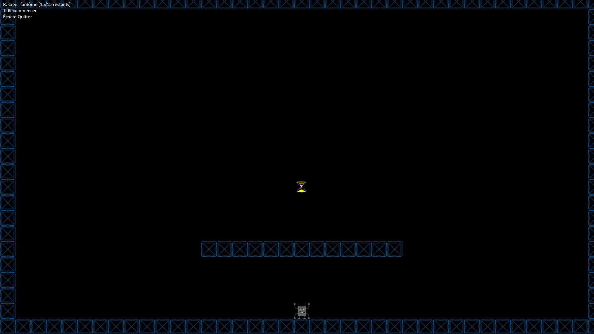

# 🚀 TempoQuest

## 📝 Description

**TempoQuest** est un jeu de plateforme et de réflexion où le temps est votre meilleur allié. Le concept central repose sur une mécanique unique : la duplication temporelle.

L'objectif est de traverser des niveaux complexes en créant des "fantômes" de votre personnage. À chaque duplication, votre personnage principal retourne au point de départ, mais le fantôme reste sur place, vous servant de plateforme solide. En grimpant sur vos propres doubles temporels, vous pouvez atteindre des hauteurs et des endroits autrement inaccessibles.

Ce projet a été imaginé pour explorer une mécanique de jeu originale, en partant d'une simple idée de "platformer" pour arriver à un concept qui pousse à la réflexion et à la stratégie.

## 👥 L'Équipe

- **Diennet Teddy** (@teddyd-hub) : Mécaniques de jeu et conception des niveaux, gestion des comptes rendus.
- **Benzaoui Ryad** (@Flast-24) : Développement du personnage et de la mécanique de duplication, chef de projet.
- **Amar hidoux Raphaël** (@hophopraph-coder) : Interface utilisateur, conception des sprites et des sons, gestion du calendrier.

*Note : Le projet a été développé en collaboration constante, avec une répartition flexible des tâches.*

## 🛠️ Aspects Techniques

Ce projet met en œuvre plusieurs concepts du programme de NSI :

- **Langages & Bibliothèques :** Python avec la bibliothèque **Arcade**, utilisée pour la première fois par l'équipe.
- **Structures de données :** Utilisation de listes pour gérer les murs, les fantômes et les objets. Les niveaux sont stockés et chargés en **JSON**, ce qui permet une grande flexibilité.
- **Programmation Orientée Objet :** Le code est structuré autour de classes comme `Player`, `Ghost`, `GameView`, et `LevelEditorView`, ce qui permet de bien séparer les responsabilités.
- **Gestion de fichiers :** Le système de création, de modification, de renommage et de suppression de niveaux repose entièrement sur la manipulation de fichiers JSON.

## 🚀 Installation et Utilisation

1.  **Prérequis :** Assurez-vous d'avoir Python 3.10+ installé.
2.  **Installation :** Créez un environnement virtuel et installez les dépendances :
    ```sh
    python -m venv .venv
    source .venv/bin/activate  # Sur Windows: .venv\Scripts\activate
    pip install -r requirements.txt
    ```
3.  **Lancement :** Pour démarrer le jeu, exécutez la commande suivante depuis la racine du projet :
    ```sh
    python sources/main.py
    ```

## 📸 Captures d'écran



## 📜 Licence

Le code source de ce projet est placé sous la **Licence Publique Générale GNU v3.0 (GPLv3)**.
Le texte de la documentation (`.md`, `.txt`) est placé sous licence **Creative Commons CC BY-SA**.

Vous trouverez le texte complet de la licence GPLv3 dans le fichier `Licence.txt`.
